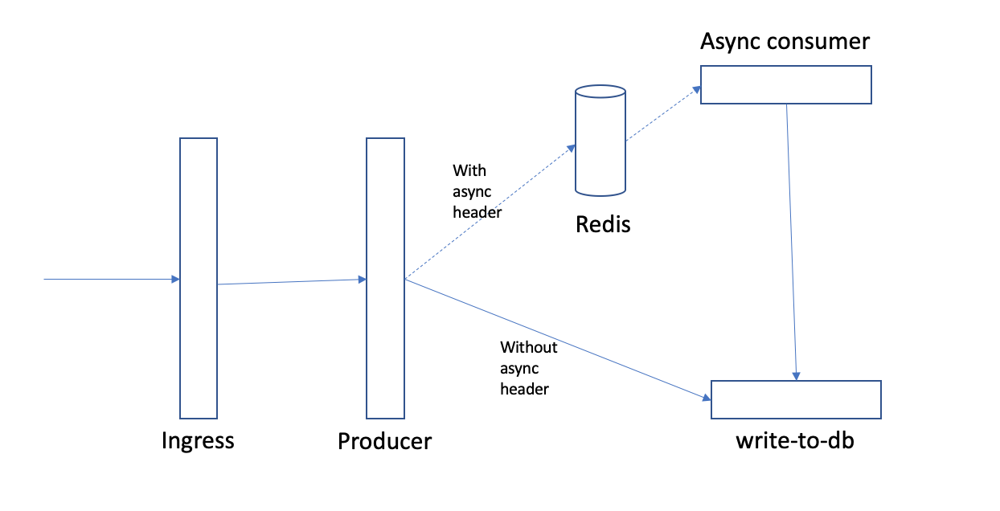

## Set up K8s Ingress to manage traffic



### Set up Ingress and ALB

Create ingress for `*.mycluster-guoyc-dff43bc8701fcd5837d6de963718ad39-0000.us-south.containers.appdomain.cloud` by running
```
kubectl apply -f config/ingress/ingress.yaml
```

The ingress looks like:
```
apiVersion: networking.k8s.io/v1beta1
kind: Ingress
metadata:
 name: test-ingress
 annotations:
   kubernetes.io/ingress.class: "public-iks-k8s-nginx"
spec:
 rules:
 - host: "*.mycluster-guoyc-dff43bc8701fcd5837d6de963718ad39-0000.us-south.containers.appdomain.cloud"
   http:
     paths:
     - path: /
       backend:
         serviceName: producer-service
         servicePort: 80
```

Create an ALB to run Ingress image:
```
ibmcloud ks ingress alb create classic --cluster btmlejad0vtg3abe4ujg --type public --zone dal10 --vlan 2877134 --version 0.34.1_391_iks
```


### Test

```
curl http://169.60.240.154 -H "Host: write-to-db-default.mycluster-guoyc-dff43bc8701fcd5837d6de963718ad39-0000.us-south.containers.appdomain.cloud" -H "Prefer: respond-async"
```

```
curl http://169.60.240.154 -H "Host: helloworld-go-default.mycluster-guoyc-dff43bc8701fcd5837d6de963718ad39-0000.us-south.containers.appdomain.cloud" -H "Prefer: respond-async"
```

### Inadequacy

Ingress only supports Path based routing and doesn't support complex routing rules, e.g. header, redirect, and ect.

Producer is heavy because producer has to forward requests even without Async header.