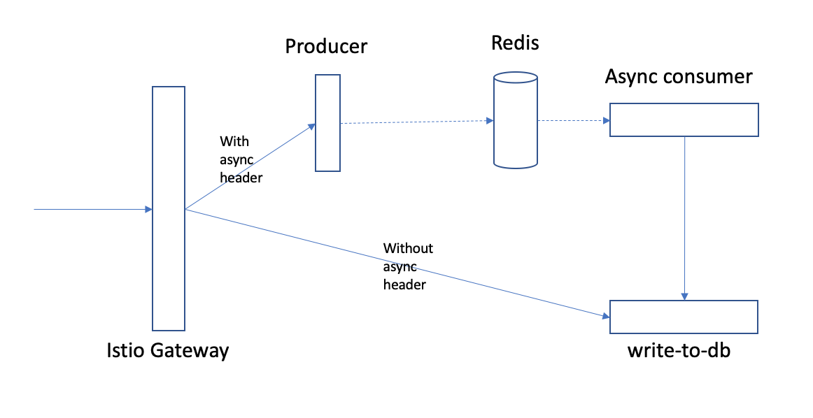

## Set up virtual service to manage traffic



### Add Producer into mesh

You can manually inject a sidecar to Producer or automatically inject a sidecar, refer to [here](https://istio.io/latest/docs/setup/additional-setup/sidecar-injection/).

### Set up virtual service for async call before Knative service created

1. Delete your app service
```
kubectl delete -f test/app/service.yml
```

2. Set up virtual serivce to route the requests with async header to Producer

```
k apply -f config/vs/vs.yaml
```

The virtual service looks like:
```
apiVersion: networking.istio.io/v1alpha3
kind: VirtualService
metadata:
  name: async-vs
  namespace: default
spec:
  hosts:
  - "write-to-db-default.mycluster-guoyc-dff43bc8701fcd5837d6de963718ad39-0000.us-south.containers.appdomain.cloud"
  gateways:
  - knative-serving/cluster-local-gateway
  - knative-serving/knative-ingress-gateway
  http:
  - name: "route_rule1"
    match:
      - headers:
          Prefer:
            exact: respond-async
        ignoreUriCase: true
    route:
    - destination:
        host: producer-service.default.svc.cluster.local #producer-service #async-producer.default.52.116.240.92.xip.io # Destination service, must match service name
        port:
            number: 80 # Post of service, must match service port
```

3. Install your app service

```
kubectl apply -f test/app/service.yml
```

4. Test

```
curl -H "Host: write-to-db-default.mycluster-guoyc-dff43bc8701fcd5837d6de963718ad39-0000.us-south.containers.appdomain.cloud" -H "Prefer: respond-async" http://169.60.240.157:30143
```

`169.60.240.157:30143` is the IP address and port of your Istio gateway. You can get it by `kubectl get svc istio-ingressgateway -n istio-system`

### Inadequacy

The priority of virtual service with wildcard prefix hosts is low, even it is defined before Knative virtual service. So it's not able to set up a common virtual service for all services. It has to be set up case by case.